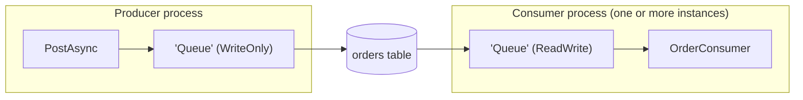

# Endpoints and configuration

[← User guide](user-guide.md)

An **endpoint** is a named connection to a transport. You post to endpoints by name, and the broker listens on every endpoint that can receive. One broker can use any mix of endpoints.

## Choosing an endpoint

| Endpoint | Package | Durable | Receives by | Failed messages | Batch send | Best for |
|---|---|---|---|---|---|---|
| **Memory** | `NymBroker` | no (process memory) | in-process channel | broker dead-letter endpoint | one by one | tests, in-process decoupling |
| **File** | `NymBroker` | yes (files) | file watcher + periodic scan | broker dead-letter endpoint | one by one | file drops, simple integration |
| **SQLite** | `NymBroker.Endpoint.Sqlite` | yes | polling a table | retried, then `Failed` row | one transaction | single-process apps, edge devices |
| **PostgreSQL** | `NymBroker.Endpoint.Postgres` | yes | polling + `LISTEN/NOTIFY` | retried, then `Failed` row | one statement | multi-instance apps already on Postgres |
| **SQL Server** | `NymBroker.Endpoint.SqlServer` | yes | polling a table | retried, then `Failed` row | one statement | multi-instance apps already on SQL Server |
| **RabbitMQ** | `NymBroker.Endpoint.RabbitMq` | yes | push (consumer) | requeued, then the queue's dead-letter exchange | one by one | a message broker you already run |
| **Azure Service Bus** | `NymBroker.Endpoint.AzureServiceBus` | yes | push (processor) | abandoned, then the queue's dead-letter queue | Service Bus batches | Azure, managed queues and topics |

"Failed messages" is explained in [Reliability](reliability.md). PostgreSQL and SQL Server let several application instances poll the same table safely; SQLite is meant for a single machine.

For the full durability, multi-node, dead-letter and crash/restart comparison, see [Delivery guarantees](delivery-guarantees.md).

## Registering endpoints in code

Every endpoint has an `Add…EndPoint(name, settings, mode)` method on the builder.

```csharp
services.AddNymBroker()
    // Core
    .AddMemoryEndPoint("Work", capacity: 1000)
    .AddFileEndPoint("Drop", new FileSettings { ReadPath = "in", PostPath = "out" })

    // NymBroker.Endpoint.Sqlite (namespace NymBroker.Endpoint.Sqlite)
    .AddSqliteEndPoint("Local", new SqliteSettings { ConnectionString = "Data Source=messages.db" })

    // NymBroker.Endpoint.Postgres
    .AddPostgresEndPoint("Pg", new PostgresSettings
    {
        ConnectionString = "Host=localhost;Database=app;Username=app;Password=…",
        TableName = "orders_queue"
    })

    // NymBroker.Endpoint.SqlServer
    .AddSqlServerEndPoint("Mssql", new SqlServerSettings
    {
        ConnectionString = "Server=…;Database=app;…",
        TableName = "dbo.orders_queue"
    })

    // NymBroker.Endpoint.RabbitMq
    .AddRabbitMqEndPoint("Rabbit", new RabbitMqSettings
    {
        HostName = "localhost", ReadQueueName = "orders.in", WriteQueueName = "orders.in"
    })

    // NymBroker.Endpoint.AzureServiceBus
    .AddAzureServiceBusEndPoint("Bus", new AzureServiceBusSettings
    {
        ConnectionString = "<namespace connection string>",   // or FullyQualifiedNamespace + Credential
        QueueName = "orders"                                  // or TopicName (+ SubscriptionName to receive)
    })
    .AddConsumer<OrderConsumer>()
    .Build();
```

Each endpoint's settings type defines its available options and defaults. The most important shared settings are:

| Setting | Endpoints | Meaning |
|---|---|---|
| `ConnectionString`, `TableName`, `AutoCreateTable` | SQLite, PostgreSQL, SQL Server | where the queue table lives; it is created (and migrated) on first use when `AutoCreateTable` is true |
| `BatchSize`, `PollInterval` | SQL endpoints | rows claimed per poll; how long to wait after a poll that found nothing |
| `LeaseTimeout`, `MaxRetryCount` | SQL endpoints | how long a claimed row is locked; attempts before a row becomes `Failed` |
| `UseNotifications` | PostgreSQL | wake idle listeners with `NOTIFY` instead of waiting out `PollInterval` |
| `ReadQueueName`, `WriteQueueName` | RabbitMQ | queue to consume from / publish to |
| `MaxConcurrentCalls`, `PrefetchCount` | Azure Service Bus | parallel handlers (above 1 gives up ordering); messages fetched ahead |
| `ReadDeadLetterQueue` | Azure Service Bus | read the entity's dead-letter queue instead (repair / replay) |
| `UseNativeDeadLetter` | RabbitMQ, Service Bus, SQL endpoints | let the transport retry and dead-letter (default `true`) — see [Reliability](reliability.md) |

Local Docker setups for PostgreSQL, SQL Server, RabbitMQ and the Service Bus emulator are in `scripts/` (`setup-postgres.ps1`, `setup-sqlserver.ps1`, `setup-rabbitmq.ps1`, `setup-servicebus.ps1`).

## Endpoint modes

Every `Add…EndPoint` takes an optional `EndpointMode`:

| Mode | Sends | Receives | Use for |
|---|---|---|---|
| `ReadWrite` (default) | ✓ | ✓ | most endpoints |
| `WriteOnly` | ✓ | — | producer processes that post and exit; dead-letter and audit endpoints; any destination you don't want processed again |
| `ReadOnly` | — | ✓ | inputs you must never post to |

```csharp
.AddSqliteEndPoint("Queue", settings, EndpointMode.WriteOnly)   // producer: no poll loop, exits promptly
```

`StartAsync` fails fast if a route, topic, dead-letter endpoint or wire tap targets a `ReadOnly` endpoint.



## Configuring endpoints from a file

Endpoints (and simple topics) can come from JSON, while consumers, subscribers and routes stay in code.

**`queuesettings.json`**

```json
{
  "NymBroker": {
    "Endpoints": [
      { "Name": "Work",  "Type": "Memory" },
      { "Name": "Drop",  "Type": "File", "Config": { "readPath": "in", "postPath": "out" } },
      { "Name": "Mssql", "Type": "SqlServer", "Config": { "connectionString": "…", "tableName": "dbo.orders_queue" } },
      { "Name": "Bus",   "Type": "AzureServiceBus", "Config": { "connectionString": "…", "queueName": "orders" } },
      { "Name": "Out",   "Type": "Memory", "Mode": "WriteOnly" }
    ],
    "Topics": [
      { "TopicName": "orders.events", "MessageType": "order.created", "SubscriberEndpoints": [ "Drop" ] }
    ]
  }
}
```

```csharp
services.AddNymBroker()
    .LoadConfiguration("queuesettings.json")   // also registers File and Memory entries
    .WithSqlServer()                           // each add-on registers its own entries
    .WithAzureServiceBus()
    .AddConsumer<OrderConsumer>()
    .Build();
```

- `Type` is matched case-insensitively. Built-in types: `Memory`, `File`, `Sql` (SQLite), `Postgres`, `RabbitMq`; add-ons define `SqlServer` and `AzureServiceBus`. An entry is only registered if the matching `With…()` is called — otherwise it is ignored, and posting to it fails with "No endpoint registered".
- `Config` holds the endpoint's settings in camelCase.
- `Mode` is a name, case-insensitive (`"ReadWrite"`, `"ReadOnly"`, `"WriteOnly"`), or a number (`0`, `1`, `2`). Omitted means `ReadWrite`. An unknown value makes the configuration fail to load with a `JsonException`.
- Secrets such as a Service Bus `TokenCredential` cannot come from the file; register those endpoints in code.
- To read from `appsettings.json` / `IConfiguration` instead of a file: `.ApplyConfiguration(BrokerConfigurationReader.Read(configuration))`.
