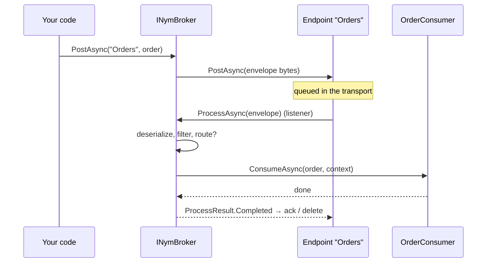

# Getting started

[← User guide](user-guide.md)

## Requirements and packages

- .NET 10.
- The core package, `NymBroker` (project `NymBroker.Core`), contains the broker plus the **Memory** and **File** endpoints. Each other transport is a separate add-on so you only take the dependencies you use:

| Package | Adds | Builder methods |
|---|---|---|
| `NymBroker` | Broker, Memory and File endpoints | `AddNymBroker()`, `AddMemoryEndPoint`, `AddFileEndPoint` |
| `NymBroker.Endpoint.Sqlite` | SQLite queue table | `AddSqliteEndPoint`, `WithSql` |
| `NymBroker.Endpoint.Postgres` | PostgreSQL queue table | `AddPostgresEndPoint`, `WithPostgres` |
| `NymBroker.Endpoint.SqlServer` | SQL Server queue table | `AddSqlServerEndPoint`, `WithSqlServer` |
| `NymBroker.Endpoint.RabbitMq` | RabbitMQ queues | `AddRabbitMqEndPoint`, `WithRabbitMq` |
| `NymBroker.Endpoint.AzureServiceBus` | Azure Service Bus queues and topics | `AddAzureServiceBusEndPoint`, `WithAzureServiceBus` |

Inside this repository, reference the projects directly; `scripts/pack.ps1` builds the NuGet packages into `artifacts/nupkg`.

```bash
dotnet new console --framework net10.0 --name Quickstart
dotnet add Quickstart reference NymBroker.Core/NymBroker.Core.csproj
dotnet add Quickstart package Microsoft.Extensions.Hosting
```

## A first broker

```csharp
using Microsoft.Extensions.DependencyInjection;
using Microsoft.Extensions.Hosting;
using NymBroker.Core.Consume;
using NymBroker.Core.DI;
using NymBroker.Core.Impl;
using NymBroker.Core.Message;

var host = Host.CreateDefaultBuilder(args)
    .ConfigureServices((_, services) =>
    {
        services.AddNymBroker()                 // 1. start the builder
            .AddMemoryEndPoint("Orders")        // 2. an endpoint to send to and receive from
            .AddConsumer<OrderConsumer>()       // 3. who handles Order messages
            .Build();                           // 4. register everything in DI
    })
    .Build();

await host.StartAsync();                                         // starts listening on "Orders"
var broker = host.Services.GetRequiredService<INymBroker>();
await broker.PostAsync("Orders", new Order("ORD-1", 49.90m));    // 5. send

await host.WaitForShutdownAsync();                               // Ctrl+C stops the broker cleanly

[MessageName("order.created")]
public sealed record Order(string Id, decimal Amount);

public sealed class OrderConsumer : IConsume<Order>
{
    public Task ConsumeAsync(Order message, IMessageContext context, CancellationToken ct = default)
    {
        Console.WriteLine($"Order {message.Id}: {message.Amount}");
        return Task.CompletedTask;
    }
}
```

What happens:



## The broker's lifetime

- `Build()` registers `INymBroker` as a singleton and a hosted service that calls `StartAsync` / `StopAsync` with the host. In a plain console app without a host you can call `broker.StartAsync()` and `broker.StopAsync()` yourself.
- `StartAsync` validates the configuration (for example, a route to a read-only endpoint throws), starts scheduled actions, and starts listening on every endpoint that can receive.
- `StopAsync` stops the listeners. Endpoints finish the message they are handling and record its result before returning, so stopping does not cause duplicates.
- You can `PostAsync` before `StartAsync` — the message waits in the transport and is processed once the broker starts.

## Where to go next

- Define richer messages and consumers: [Messages and consumers](messages-and-consumers.md).
- Use a durable transport instead of `Memory`: [Endpoints and configuration](endpoints-and-configuration.md).
- Send many messages or large ones: [Sending messages](sending-messages.md).

Runnable samples live in `samples/` — `NymBroker.Sample` (routing, scheduling, file + memory), `NymBroker.SqlSample`, `NymBroker.PostgresSample`, `NymBroker.SqlServerSample`, `NymBroker.RabbitSample`, `NymBroker.AzureServiceBusSample`, `NymBroker.WebSample`, `NymBroker.RoutingSample`, `NymBroker.CsvSample`, and the `NymBroker.ProducerSample` / `NymBroker.ConsumerSample` pair.
