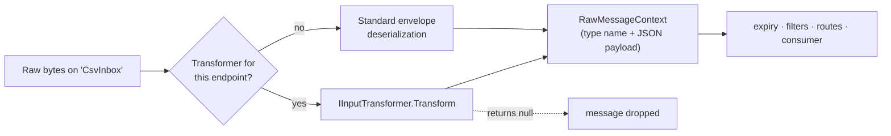

# Pipeline extensions

[← User guide](user-guide.md)

Three ways to plug your own logic into the broker: **filters** see every message before routing, **input transformers** turn non-JSON input into messages, and **scheduled actions** run code on a timer or cron schedule.

## Filters

A filter runs for every received message after deserialization and the expiry check, and before routes, topics and consumers. Return the context to continue, a modified context to change it, or `null` to drop the message (it is then completed — not retried, not dead-lettered).

```csharp
public sealed class BlockTestTraffic : IMessageFilter
{
    public IMessageContext? Filter(IMessageContext context)
        => context.Address?.From == "TestInbox" ? null : context;
}

broker.AddFilter(new BlockTestTraffic());   // on INymBroker; filters run in the order they were added
```

Built-in filters, added on the builder:

| Builder method | What it does |
|---|---|
| `AddIdempotentReceiver(ttl)` | drops messages whose `id` was already processed within `ttl` (in memory, per process; `AddSqlServerIdempotency` / `AddPostgresIdempotency` for a durable store shared by all instances; `AddSqliteIdempotency` for a restart-safe store on one host) — claimed before routing, completed or released (on `Retry`) after — see [Reliability](reliability.md#duplicate-detection) |
| `AddMessageLoggingFilter()` | logs every message (id, type, source, created, payload) at `Debug` level |

## Input transformers

Use an input transformer when an endpoint receives data that is **not** a NymBroker envelope — CSV lines, plain text, another system's JSON. It replaces the envelope deserialization for that endpoint (or for all endpoints):



```csharp
using NymBroker.Core.Serialize;   // RawMessageContext
using NymBroker.Core.Transform;   // IInputTransformer

public sealed class CsvOrderTransformer : IInputTransformer
{
    public RawMessageContext? Transform(ReadOnlySpan<byte> input, string? sourceEndpoint)
    {
        var parts = Encoding.UTF8.GetString(input).Trim().Split(',');
        if (parts.Length != 3) return null;   // drop lines that aren't orders

        return new RawMessageContext
        {
            Id            = Guid.NewGuid(),
            CorrelationId = Guid.NewGuid(),
            MessageType   = "order.created",          // must match a registered [MessageName]
            Created       = DateTime.UtcNow,
            RawMessage    = JsonSerializer.SerializeToElement(new
            {
                orderId  = parts[0],
                customer = parts[1],
                amount   = decimal.Parse(parts[2], CultureInfo.InvariantCulture)
            })
        };
    }
}

services.AddNymBroker()
    .AddFileEndPoint("CsvInbox", new FileSettings { ReadPath = "csv-in", SearchPattern = "*.csv" })
    .AddInputTransformer<CsvOrderTransformer>("CsvInbox")   // omit the name for a global fallback
    .AddConsumer<OrderConsumer>()
    .Build();
```

- The result goes through the rest of the pipeline exactly like a normal message: consumers receive the typed `OrderCreated`.
- Returning `null` drops the input without logging; log inside the transformer if you need a trace. A transformer that **throws** counts as a processing failure and is retried by transports that can.
- To push raw input yourself, post bytes with `PostAsync(endpoint, (Stream)stream)` — see [Sending messages](sending-messages.md#pre-serialized-bytes). The `samples/NymBroker.CsvSample` project shows the full flow.

## Scheduled actions

Run code periodically while the broker is running — for example to post a heartbeat, poll an external system, or trigger a nightly job.

```csharp
// Every 30 seconds (first run after 30 seconds).
broker.AddScheduledAction(TimeSpan.FromSeconds(30), () => logger.LogInformation("alive"));

// With parameters (one or two), e.g. to post a message.
broker.AddScheduledAction<INymBroker>(
    TimeSpan.FromMinutes(1),
    b => b.PostAsync("Prices", new PriceRequest("ACME")).GetAwaiter().GetResult(),
    broker);

// Cron (Cronos syntax, local time zone): weekdays at 17:00.
broker.AddScheduledAction<INymBroker>(
    "0 17 * * 1-5",
    b => b.PostAsync("Reports", new DailyReportRequest()).GetAwaiter().GetResult(),
    broker);
```

- Actions are synchronous (`Action`); call async code with `.GetAwaiter().GetResult()`, or post a message and do the async work in a consumer.
- Actions start with `StartAsync` and stop with `StopAsync`. They can be added at any time: an action added while the broker is running starts right away, is stopped by `StopAsync`, and — like the others — is started again by a later `StartAsync`.
- A run that throws is logged at `Error` and the schedule continues with the next occurrence. `StopAsync` never throws because of an action.
