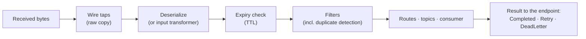
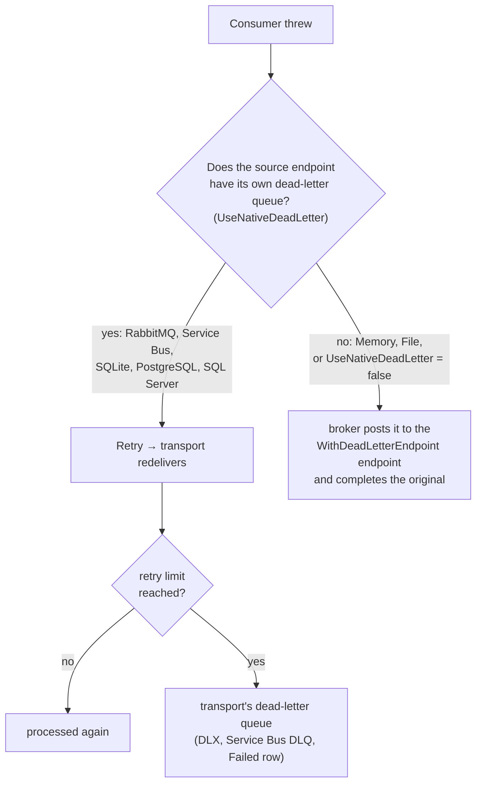

# Reliability

[← User guide](user-guide.md)

NymBroker delivers messages **at least once**: a message is only removed from its transport after it was handled, so a crash or a failure leads to redelivery rather than loss. This page explains what happens when handling fails, where failed messages end up, and the tools for expiry, auditing and duplicates.

## The processing pipeline



Each step can end processing early: an undecodable or expired message is dead-lettered, a filter can drop a message, a failing consumer causes a retry.

## Success, retry, dead letter

After processing, the broker gives the source endpoint one of three results, and the endpoint settles the message with its transport:

| Result | When | What the transport does |
|---|---|---|
| **Completed** | handled successfully, or intentionally dropped (filtered, duplicate, no consumer) | ack / complete / mark the row Completed |
| **Retry** | a consumer or topic subscriber threw, or a route's destination failed | redeliver later; dead-letter once the retry limit is reached |
| **DeadLetter** | the message can never succeed: undecodable bytes, expired, unknown compression | dead-letter immediately, with the reason |



### Per endpoint

| Endpoint | Retry | Dead letter | Retry limit |
|---|---|---|---|
| SQLite, PostgreSQL, SQL Server | row back to `Pending` | row `Failed`, reason in the error column | `MaxRetryCount` (default 5) |
| RabbitMQ | nack with requeue | nack without requeue → the queue's dead-letter exchange, if configured | one redelivery (`RejectRedeliveredFailures`) |
| Azure Service Bus | abandon | the queue's / subscription's dead-letter queue, with reason and description | the entity's `MaxDeliveryCount` |
| Memory, File | — (cannot redeliver) | broker dead-letter endpoint | none: failures go straight to the dead-letter endpoint |

Set `UseNativeDeadLetter = false` on a RabbitMQ, Service Bus or SQL endpoint to make it behave like Memory/File: no retries, failures go to the broker's dead-letter endpoint.

## The broker's dead-letter endpoint

Messages from endpoints without their own dead-letter queue (and failures of a type-based `PublishAsync`) go to the endpoint named by `WithDeadLetterEndpoint`:

```csharp
services.AddNymBroker()
    .AddMemoryEndPoint("Orders")
    .AddFileEndPoint("DeadLetters", new FileSettings { PostPath = "dead-letters" }, EndpointMode.WriteOnly)
    .WithDeadLetterEndpoint("DeadLetters")
    .AddConsumer<OrderConsumer>()
    .Build();
```

- Make it **`WriteOnly`** unless you deliberately consume from it in the same broker. A listening dead-letter endpoint feeds its messages straight back into processing, and a consumer that keeps failing would loop.
- Without a dead-letter endpoint, such failures are logged and the message is dropped.
- Every dead-lettering is logged at `Warning` with its reason and counted in the `nymbroker.messages.dead_lettered` metric.

## Why a message was dead-lettered

A message posted to the broker's dead-letter endpoint carries the reason inside its envelope, in a `deadLetter` block:

```json
{
  "id": "…", "messageType": "order.created", "message": { … },
  "deadLetter": {
    "reason": "ConsumerFailed",
    "description": "Stock not available for ORD-1",
    "exceptionType": "System.InvalidOperationException",
    "sourceEndpoint": "Orders",
    "deadLetteredAt": "2026-10-06T08:15:00Z",
    "deliveryCount": null
  }
}
```

Read it from a consumer as `context.DeadLetter` (`DeadLetterInfo`). Reasons are the constants in `DeadLetterReasons`: `ConsumerFailed`, `TopicDeliveryFailed`, `DeserializationFailed`, `Expired`, `UnknownCompression` — plus transport reasons such as Service Bus's `MaxDeliveryCountExceeded`.

Bytes that were not even JSON are wrapped in an envelope of type `nymbroker.undecodable` (`UndecodableMessage`, with `PayloadBase64` and, for valid UTF-8, `PayloadText`), so they can be inspected with `IConsume<UndecodableMessage>`.

### Inspecting and replaying

**Broker dead-letter endpoint** — consume it with a separate broker (or endpoint in `ReadWrite` mode on purpose) and re-post what can be fixed:

```csharp
public sealed class ReplayConsumer(INymBroker broker) : IConsume<OrderCreated>
{
    public async Task ConsumeAsync(OrderCreated message, IMessageContext context, CancellationToken ct = default)
    {
        if (context.DeadLetter?.Reason == DeadLetterReasons.ConsumerFailed)
            await broker.PostAsync("Orders", message, ct);   // a fresh envelope; failing again dead-letters it again
    }
}
```

**Azure Service Bus** — add a second endpoint on the same queue with `ReadDeadLetterQueue = true`. Its messages carry the same `deadLetter` block, filled from Service Bus's dead-letter reason and description. A consumer that returns normally removes the message from the dead-letter queue.

**SQL endpoints** — failed rows stay in the queue table with `status = 3` and the reason in `last_error` (`LastError` in SQLite). To retry them, reset them to pending:

```sql
-- PostgreSQL / SQL Server (SQLite: Status, AttemptCount, LastError, FailedAtUtc)
UPDATE orders_queue
SET status = 0, attempt_count = 0, last_error = NULL, failed_at_utc = NULL
WHERE status = 3;
```

**RabbitMQ** — dead-lettered messages are in whatever queue is bound to the queue's dead-letter exchange; RabbitMQ records the reason `rejected` in the `x-death` header (the broker's reason is logged).

## Duplicate detection

At-least-once delivery means a message can occasionally be processed twice — after a crash, a lost lock, or a retried batch post. Either make consumers idempotent, or let the broker drop repeats of the same message id:

```csharp
services.AddNymBroker()
    .AddIdempotentReceiver(TimeSpan.FromHours(2))   // default: 24 hours
    …
```

With `AddIdempotentReceiver(ttl)` the ids are remembered **in memory, per process**: it protects against redelivery to the same instance within the window, not across several instances or restarts. For that, use a database store, which every instance shares through one table:

```csharp
// dotnet add package NymBroker.Idempotency.SqlServer
services.AddNymBroker()
    .AddSqlServerIdempotency(new SqlServerIdempotencySettings
    {
        ConnectionString = "...",
        TableName        = "dbo.nymbroker_idempotency",   // created automatically (AutoCreateTable = true)
        Ttl              = TimeSpan.FromHours(24),        // how long a processed id is remembered
        LeaseTimeout     = TimeSpan.FromMinutes(5),       // how long a claim survives a crashed process
        CleanupInterval  = TimeSpan.FromMinutes(10)       // a hosted service deletes expired rows; Zero disables it
    })
    …
```

PostgreSQL ([#56](https://github.com/nymankla/NymBroker/issues/56)) and SQLite ([#57](https://github.com/nymankla/NymBroker/issues/57)) stores are planned. Any other store: implement `IIdempotencyStore` and register it with `AddIdempotentReceiver(store)` or `AddIdempotentReceiver<TStore>()`.

### How it works

The broker claims the message id after decoding (and after reassembling a split message — its parts are not claimed), before routes, topics and consumers run:

| Claim | What happens |
|---|---|
| new | The message is processed. If processing ends in `Retry` (or throws), the claim is **released**, so the transport's redelivery is processed. Any other result (`Completed`, `DeadLetter`, also after the broker posted it to its dead-letter endpoint) **completes** the claim, and the id is remembered for the TTL. |
| already processed within the TTL | Dropped as a duplicate: `Completed`, counted in `nymbroker.messages.duplicates`. |
| claimed by another delivery that is still running | `Retry`: the transport redelivers it later, when the other delivery has finished. |
| the store fails | `Retry`, logged as an error. The broker never processes a message without the duplicate check. |

A claim is a lease (`LeaseTimeout`): if the process dies after claiming, the claim expires and the message can be processed again. A store that fails to complete or release a claim is logged; the lease then expires — worst case, one extra delivery.

Before [#55](https://github.com/nymankla/NymBroker/issues/55) the id was recorded *before* processing, so a message whose consumer failed and was redelivered by the transport was then dropped as a duplicate and lost.

**Limits.** This is duplicate detection for at-least-once delivery, not exactly-once processing. The consumer's side effects are not in the store's transaction: if the process dies after the consumer succeeded but before the claim is completed, the message is processed again once the lease expires. Messages without an id (`Guid.Empty`, e.g. from an input transformer) are not checked.

## Message expiry (TTL)

Drop messages that are too old to be useful:

```csharp
services.AddNymBroker()
    .DiscardMessagesOlderThan(TimeSpan.FromMinutes(15))
    …
```

The age is measured from the envelope's `created` time. Expired messages are dead-lettered with reason `Expired` (natively, or to the broker's dead-letter endpoint) before filters, routes or consumers see them.

## Wire tap

Copy every raw message, before any processing, to one or more audit endpoints:

```csharp
services.AddNymBroker()
    .AddFileEndPoint("Audit", new FileSettings { PostPath = "audit" }, EndpointMode.WriteOnly)
    .AddWireTap("Audit")
    …
```

Taps see everything, including messages that are later filtered, expired or dead-lettered. A failing tap is logged and does not affect processing.

## Shutdown

When the host stops, each endpoint stops receiving, lets the message in progress finish, and records its result before `StopAsync` returns. Messages claimed but not yet started are released by their transport (lease or lock expiry) and delivered again later — never lost.
