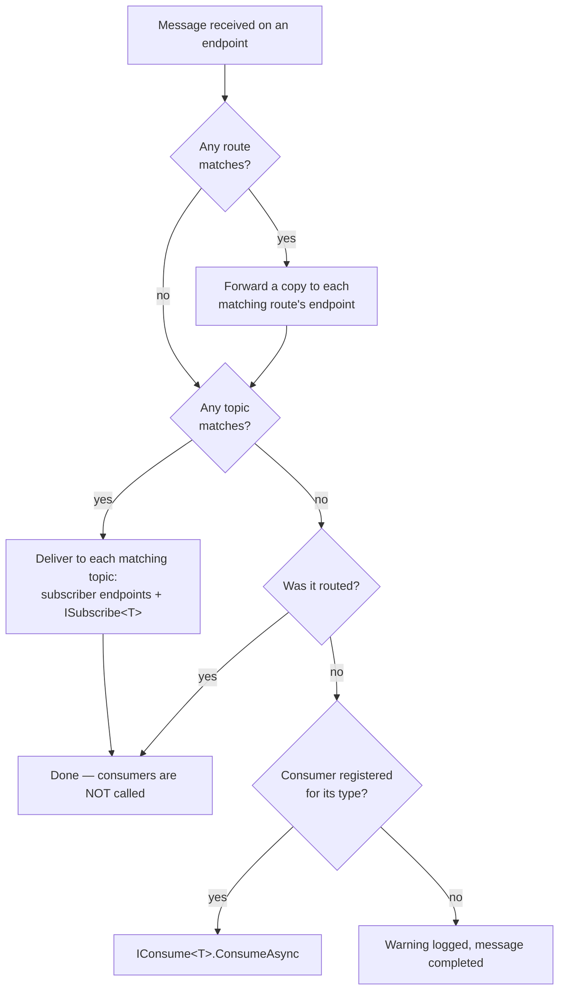

# Routing and publish/subscribe

[← User guide](user-guide.md)

When a message arrives at an endpoint, the broker decides where it goes. Three mechanisms compete for it:

- **Routes** forward it to another endpoint.
- **Topics** fan it out to several endpoints and/or in-process subscribers.
- **Consumers** handle it in your code.

## What decides where a message goes



- **All** matching routes and **all** matching topics get the message.
- A message that was routed or matched a topic is **not** given to a consumer. If you want both, add an `ISubscribe<T>` subscriber to the topic, or route the copy to an endpoint that has the consumer.
- Before this, [filters](pipeline-extensions.md#filters), [duplicate detection](reliability.md#duplicate-detection) and [message expiry](reliability.md#message-expiry-ttl) may already have dropped the message.

## Routes

Routes are added on `INymBroker` — typically right after the host is built, before or after `StartAsync`:

```csharp
var broker = host.Services.GetRequiredService<INymBroker>();

// Every OrderCreated goes to the "Archive" endpoint.
broker.Route<OrderCreated>().To("Archive").Build();

// Only high-priority orders, and only those received on "WebOrders".
broker.Route<OrderCreated>()
    .To("Priority")
    .WhenFrom("WebOrders")
    .When(msg => msg.GetProperty("priority").GetString() == "high")
    .Build();

// Any message type older than 5 minutes.
broker.Route()
    .To("Stale")
    .WhenMessageIsOlderThan(TimeSpan.FromMinutes(5))
    .Build();
```

`.Build()` registers the route; it throws if `.To(...)` is missing.

### Conditions

| Method | Matches when |
|---|---|
| `.WhenFrom(endpoint)` | the message was received on that endpoint |
| `.WhenNotFrom(endpoint)` | the message was received on any other endpoint |
| `.When(json => …)` | the predicate returns true for the **message payload** (a `JsonElement`, camelCase property names) |
| `.WhenMessageIsOlderThan(age)` | `created` is more than `age` ago |
| `.And(a, b)` / `.Or(a, b)` | both / either of two condition objects match |

A route has **one** source filter (`WhenFrom` / `WhenNotFrom`) and **one** content condition. `When`, `WhenMessageIsOlderThan`, `And` and `Or` each *replace* the content condition, so `.When(a).When(b)` only checks `b` ([#47](https://github.com/nymankla/NymBroker/issues/47) proposes combining them). To combine content conditions, build them as objects and pass them to `And` / `Or`:

```csharp
using NymBroker.Core.Route;

broker.Route<OrderCreated>()
    .To("Review")
    .Or(new JsonRouteCondition(m => m.GetProperty("amount").GetDecimal() > 10_000m),
        new AndRouteCondition(
            new JsonRouteCondition(m => m.GetProperty("priority").GetString() == "high"),
            new MessageAgeRouteCondition(TimeSpan.FromMinutes(1))))
    .Build();
```

The condition classes (`JsonRouteCondition`, `FromRouteCondition`, `NotFromRouteCondition`, `MessageAgeRouteCondition`, `AndRouteCondition`, `OrRouteCondition`) implement `IRouteCondition`; implement it yourself for custom logic. For full control, subclass `RouteContext`, override `Evaluate(messageType, context, payload)`, and register it with `broker.Route(() => new MyRouteContext()).To("Destination").Build()`.

### Avoid routing loops

Every endpoint that can receive is listened to by the broker. A route whose destination is an endpoint the broker also listens on delivers the message there, where it is processed again — and matches the same route again. Guard such routes with `WhenFrom` / `WhenNotFrom`, or make the destination `WriteOnly`:

```csharp
broker.Route<OrderCreated>().To("Copies").WhenNotFrom("Copies").Build();
```

## Topics and subscribers

A topic delivers a copy of a message to several places — the [Publish-Subscribe Channel](https://www.enterpriseintegrationpatterns.com/patterns/messaging/PublishSubscribeChannel.html) pattern. Topics are configured on the builder:

```csharp
services.AddNymBroker()
    .AddSqlServerEndPoint("Orders", ordersSettings)
    .AddFileEndPoint("Audit", new FileSettings { PostPath = "audit" }, EndpointMode.WriteOnly)
    .AddTopic<OrderCreated>("orders.events")
        .SubscribeTo("Audit")                    // post a copy to an endpoint
        .SubscribeWith<BillingSubscriber>()      // call in-process subscribers
        .SubscribeWith<EmailSubscriber>()
        .When(msg => msg.GetProperty("amount").GetDecimal() > 0)   // optional; one condition per topic (#47)
        .Build()                                 // back to the broker builder
    .Build();

public sealed class BillingSubscriber : ISubscribe<OrderCreated>
{
    public Task ReceiveAsync(OrderCreated message, IMessageContext context, CancellationToken ct = default)
        => Task.CompletedTask;
}
```

A topic is triggered in two ways:

- **Implicitly** — every `OrderCreated` received on any endpoint (or published by type with `PublishAsync(message)`) is matched against topics for its type and their conditions.
- **Explicitly** — `PublishAsync("orders.events", message)` delivers straight to that topic, without routes or consumers.

Subscribers:

- `ISubscribe<T>` is the topic counterpart of `IConsume<T>`; register them with `SubscribeWith<T>()` (or `AddSubscriber<T>()`). Each topic can have any number.
- Subscribers of one delivery run one after another in a shared DI scope. If one throws, the others still run; afterwards the delivery counts as failed and is retried or dead-lettered like a consumer failure ([Reliability](reliability.md)).
- When a topic posts a copy to an endpoint the broker also listens on, guard it like a route so the copy doesn't trigger the topic again: `.When(new NotFromRouteCondition("Audit"))`.

## Choosing between them

| You want… | Use |
|---|---|
| exactly one handler in your code | a consumer (`IConsume<T>`) |
| several independent handlers in your code | a topic with `ISubscribe<T>` subscribers |
| to forward messages to another system or queue | a route, or a topic with `SubscribeTo` |
| a copy of *every* raw message for auditing, before any processing | a [wire tap](reliability.md#wire-tap) |
