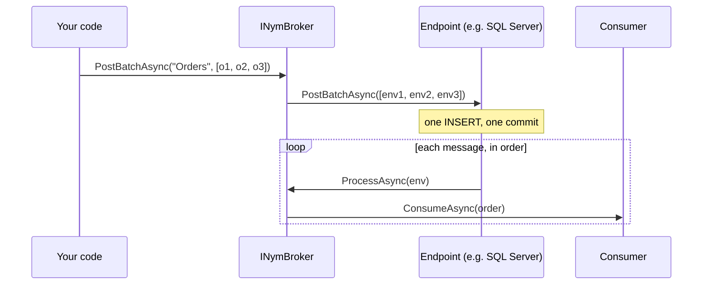
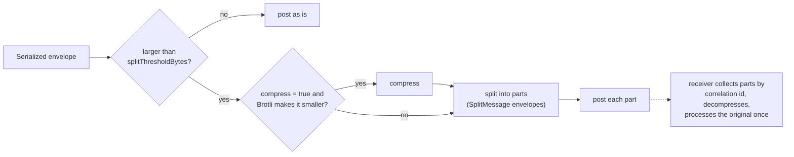

# Sending messages

[← User guide](user-guide.md)

There are two ways to send: **post** to a named endpoint, or **publish** without naming one. Both are on `INymBroker`, which you get from DI.

| Method | Sends to | Typical use |
|---|---|---|
| `PostAsync<T>(endpoint, message)` | one endpoint | commands, work items, anything with a known destination |
| `PostBatchAsync<T>(endpoint, messages)` | one endpoint, many messages in one call | bulk imports, fan-in of many items |
| `PostAsync(endpoint, stream)` | one endpoint, pre-serialized bytes | raw input for an [input transformer](pipeline-extensions.md#input-transformers) |
| `PublishAsync<T>(message)` | processed in-process: routes, topics, consumers | events raised inside the same application |
| `PublishAsync<T>(topicName, message)` | one named topic | events with known subscribers |
| `PublishBatchAsync<T>(...)` | as above, many messages | bulk events |

## Posting to an endpoint

```csharp
await broker.PostAsync("Orders", new OrderCreated("ORD-1", "Alice", 49.90m));
```

The message is serialized into an envelope and handed to the endpoint, which stores or transmits it. It is processed when the endpoint's listener receives it — immediately for an in-memory endpoint, on the next poll for a database queue.

`PostAsync` throws `InvalidOperationException` if no endpoint has that name or the endpoint is `ReadOnly`. Otherwise it returns once the transport has accepted the message (for the database endpoints: once the row is committed).

### Pre-serialized bytes

`PostAsync(string, Stream)` posts the bytes as they are — use it for input that an [input transformer](pipeline-extensions.md#input-transformers) turns into a message, or for envelopes you built yourself. Cast to `Stream`, or C# picks the generic overload and serializes the stream object as a message:

```csharp
await broker.PostAsync("CsvInbox", (Stream)new MemoryStream(Encoding.UTF8.GetBytes("ORD-1,Alice,49.90,high")));
```

## Posting a batch

```csharp
await broker.PostBatchAsync("Orders", orders);                                  // IEnumerable<T>
await broker.PostBatchAsync("Orders", orders, correlationId: importId);          // same CorrelationId on all
```

Every message still gets **its own envelope** and is received, consumed and settled **one by one** — consumers, routes and dead-lettering don't change. Only the send is batched: the endpoint gets the whole list in one call and can send it in one round trip or transaction.



| Endpoint | How the batch is sent | All or nothing? |
|---|---|---|
| SQL Server, PostgreSQL, SQLite | one insert in one transaction | yes |
| Azure Service Bus | as few Service Bus batches as fit (256 KB each on Standard) | per Service Bus batch |
| RabbitMQ, File, Memory | one message at a time | no |

Measured on local containers, batches of 100 raised throughput from about 540 to 9 000 messages/s on PostgreSQL and from about 320 to 5 400 on SQL Server.

- Order is preserved. An empty batch does nothing; a `null` element throws `ArgumentException` before anything is sent.
- If a non-atomic batch fails partway, some messages may already be sent. Retrying is safe if receivers use the [idempotent receiver](reliability.md#duplicate-detection).
- Use `PostBatchAsync`, not `PostAsync`, for a list: `PostAsync("Orders", list)` compiles but posts the whole list as **one** message.

## Large messages: split and compress

Some transports limit message size (Azure Service Bus Standard: 256 KB; UDP: ~64 KB). Pass `splitThresholdBytes` and the broker splits larger messages into parts and reassembles them on the receiving side:

```csharp
await broker.PostAsync("Orders", bigOrder, splitThresholdBytes: 200_000);
await broker.PostBatchAsync("Orders", orders, splitThresholdBytes: 200_000);   // per message
```



- Compression is on by default (`compress: true`) and only used when it actually shrinks the payload, so already-compressed or binary data isn't compressed twice.
- Only the part that completes the message triggers processing; consumers see the original message once.
- **Reassembly happens in memory in the receiving broker.** All parts of one message must reach the same broker instance; incomplete messages are discarded after 2 hours. If several instances compete for the same queue, avoid splitting (or keep messages under the transport's limit).

## Publishing

Publishing doesn't name an endpoint; the broker decides where the message goes.

```csharp
// By type: the message goes through the full in-process pipeline —
// routes, topics for OrderCreated, or the OrderCreated consumer.
await broker.PublishAsync(new OrderCreated("ORD-1", "Alice", 49.90m));

// To a named topic: delivered to that topic's subscriber endpoints and ISubscribe<T> subscribers only.
await broker.PublishAsync("orders.events", new OrderCreated("ORD-1", "Alice", 49.90m));
```

- A type-based publish runs **in your process, right now** — there is no queue in between. If a consumer throws, the message goes to the broker's dead-letter endpoint (if configured); if a route's destination can't be reached, `PublishAsync` throws.
- A named publish to an unknown topic logs a warning and does nothing.
- `PublishBatchAsync(messages)` publishes each message in turn by type. `PublishBatchAsync(topicName, messages)` sends one batch to each of the topic's subscriber endpoints, and calls `ISubscribe<T>` subscribers one message at a time.

Topics are set up when you configure the broker — see [Routing and publish/subscribe](routing-and-pubsub.md#topics-and-subscribers).
