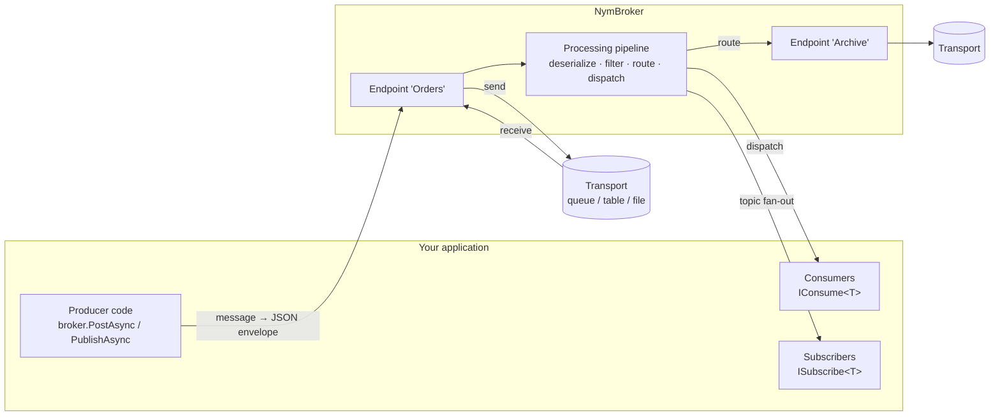

# NymBroker user guide

NymBroker moves typed .NET messages between parts of your system — in-process queues, files, databases, RabbitMQ or Azure Service Bus — and hands each one to the right piece of your code. You post a message to a named **endpoint**; the broker receives it there, decides what should happen to it (**route** it to another endpoint, **publish** it to topic subscribers, or **consume** it), and tells the transport whether it succeeded so failed messages are retried or dead-lettered.

This guide is for application developers using the broker. If you want to add a new transport, see [Writing an endpoint](writing-an-endpoint.md).

## How it fits together



- **Messages** are your own classes or records. The broker wraps each in a JSON **envelope** with an id, correlation id, type name and timestamp.
- **Endpoints** are named connections to a transport: `Memory`, `File`, `SQLite`, `PostgreSQL`, `SQL Server`, `RabbitMQ`, `Azure Service Bus`. You post to an endpoint by name; the broker listens on every endpoint that can receive.
- The **pipeline** decides what happens to each received message. A message that matches a **route** or a **topic** is forwarded there; otherwise it goes to the **consumer** registered for its type.
- **Results flow back to the transport.** When a consumer fails, the endpoint's transport retries the message and eventually dead-letters it — or, for transports without that ability, the broker sends it to a dead-letter endpoint.

## Contents

| Page | What it covers |
|---|---|
| [Getting started](getting-started.md) | Packages, a first broker in a console app, hosting and shutdown |
| [Messages and consumers](messages-and-consumers.md) | Message types, the envelope, `IConsume<T>`, `IMessageContext`, DI scopes |
| [Sending messages](sending-messages.md) | `PostAsync`, batch posting, large messages (split + compression), publishing |
| [Routing and publish/subscribe](routing-and-pubsub.md) | Routes and conditions, topics and subscribers, what decides where a message goes |
| [Endpoints and configuration](endpoints-and-configuration.md) | Every endpoint type, endpoint modes, configuring in code or from `queuesettings.json` |
| [Delivery guarantees](delivery-guarantees.md) | At-least-once limits, ordering, crash behavior and endpoint capabilities |
| [Reliability](reliability.md) | Retries, dead-lettering (native and broker), the dead-letter reason, TTL, wire tap, duplicate detection |
| [Retry policy](resilience.md) | `RetryPolicy` options, backoff and jitter, how the File and RabbitMQ endpoints use it |
| [Pipeline extensions](pipeline-extensions.md) | Filters, input transformers for non-JSON input, scheduled actions |
| [Observability](observability.md) | Metrics, tracing, logging and health checks |

## Minimal example

```csharp
services.AddNymBroker()
    .AddMemoryEndPoint("Orders")
    .AddConsumer<OrderConsumer>()
    .Build();

// later, anywhere with INymBroker injected
await broker.PostAsync("Orders", new Order("ORD-1"));

public sealed record Order(string Id);

public sealed class OrderConsumer : IConsume<Order>
{
    public Task ConsumeAsync(Order message, IMessageContext context, CancellationToken ct = default)
    {
        Console.WriteLine($"Received order {message.Id}");
        return Task.CompletedTask;
    }
}
```

Continue with [Getting started](getting-started.md).
